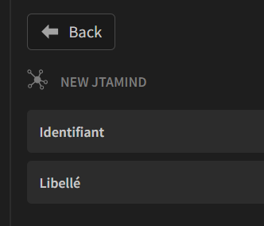
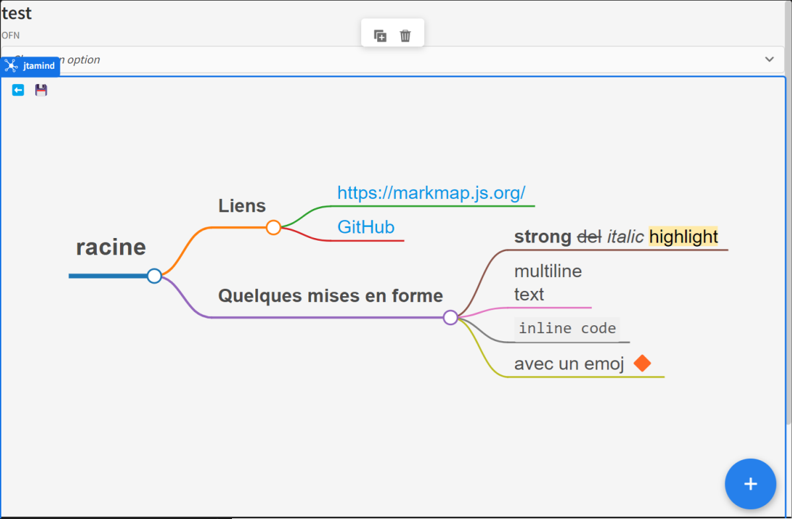

# Jtamind

# Description
MindMap Plugin for budiBase

Allows transforming content in **MarkDown** format into a MindMap.

## configuration

- **Contenu**: Content in markdown format (See example below)
- **Hauteur**: Height of the window that will contain the mind map (minimum: 200px)
- **Tempo**: Delay (in ms) used to make branches appear/disappear. (0 = no delay)
- **Espacement vertical**: Vertical space between branches
- **Espacement horizontal**: Horizontal space between nodes in the same branch
- **Padding X**: Space between node and text
- **Largeur max**: Maximum width of a branch (0 = no maximum)
- **Couleur**: Branches' color ("Defaut" = default colors)
- **Clic on item**: event executed when clicking on a label 

> **Warning**: This component will hide all components placed **below**

You can add an identifier for each item, by pasting it at the end, **separated by an "@"**. Examples: 
```
## section@identifiant
- libellé@identifiant
```
This identifier will be **hidden on display**, but will be offered in the "Click on item" event




### An additional header can be added in the markdown
 
```
---
markmap:
  key: value
  key: value
---
```
This header allows setting the display parameters mentioned [HERE](https://markmap.js.org/docs/json-options). Some examples: 
- colorFreezeLevel: 0
- initialExpandLevel: 1
- ...

## Manipulation of MapMind

- Mouse wheel: Zoom +/-
- ⬆️➡️ : Expand / collapse all nodes
-  💾 : Save the SVG
- Click + drag: Moves the mind map

## Example

### The markdown
```
# racine

## Liens

- <https://markmap.js.org/>
- [GitHub](https://github.com/gera2ld/markmap)

## Quelques mises en forme

- **strong** ~~del~~ *italic* ==highlight==
- multiline
  text
- `inline code`
- Avec un emoji 🔶
```
### The result


# Used Libraries

- Utilizes **markmap-lib** and **markmap-view** components from the library [markmap](https://markmap.js.org/docs/markmap) 
- Inspired by [this example](https://svelte.dev/repl/9499dbcf3f3240e4af42e38ab19cc9ea?version=3.47.0)

Find out more about [Budibase](https://github.com/Budibase/budibase).

<hr>

# Version française

# Description
Plugin MindMap pour budiBase

Permet de transformer un contenu au format **MarkDown** en MindMap

## configuration

- **Contenu** : Le contenu au format markdown (Voir exemple ci dessous)
- **Hauteur** : hauteur de la fenetre qui contiendra le mindmap (minimum : 200px)
- **Tempo**. : la temporisation (en ms) utilisée pour faire apparaitre / disparaitre les branches. (0 = pas de temporisation)
- **Espacement vertical** : espace vertical entre les branches 
- **Espacement horizontal** : espace horizontal entre les noeuds d'une même branche
- **Padding X** : espace entre le noeud et le texte
- **Largeur max** : largeur maximum d'une branche (0 = pas de maximum)
- **Couleur** : Couleur des branches ("Défaut" = couleurs par défaut)

> **Attention** : Ce composant masquera tous les composants placés **en dessous**

On peut ajouter un identifiant pour chaque item, en le collant à la fin, séparé par un "@". Exemples : 
```
## section@identifiant
- libellé@identifiant
```
Cet identifiant sera **masqué à l'affichage**, mais sera proposé dans l'event "Clic sur item"


### On peut ajouter une entête dans le markdown
 
```
---
markmap:
  clé: valeur
  clé: valeur
---
```
Cette entête permet de positionner les paramètres d'affichage mentionnés [ICI](https://markmap.js.org/docs/json-options). Quelques exemples : 
- colorFreezeLevel: 0
- initialExpandLevel: 1
- ...

## Manipulation du MapMind

- Molette souris : Zoom +/-
- ⬆️➡️ : ouvrir / fermer tous les noeuds
- 💾 : Enregistrer le SVG
- Cliquer + tirer : déplace le mindmap

## Exemple

### Le markdown
```
# racine

## Liens

- <https://markmap.js.org/>
- [GitHub](https://github.com/gera2ld/markmap)

## Quelques mises en forme

- **strong** ~~del~~ *italic* ==highlight==
- multiline
  text
- `inline code`
- avec un emoj 🔶
```
### Le résultat


# Librairies utilisées

- Utilise les composants **markmap-lib** et **markmap-view** de la librairie [markmap](https://markmap.js.org/docs/markmap) 
- Inspiré par [cet exemple](https://svelte.dev/repl/9499dbcf3f3240e4af42e38ab19cc9ea?version=3.47.0)

Find out more about [Budibase](https://github.com/Budibase/budibase).
